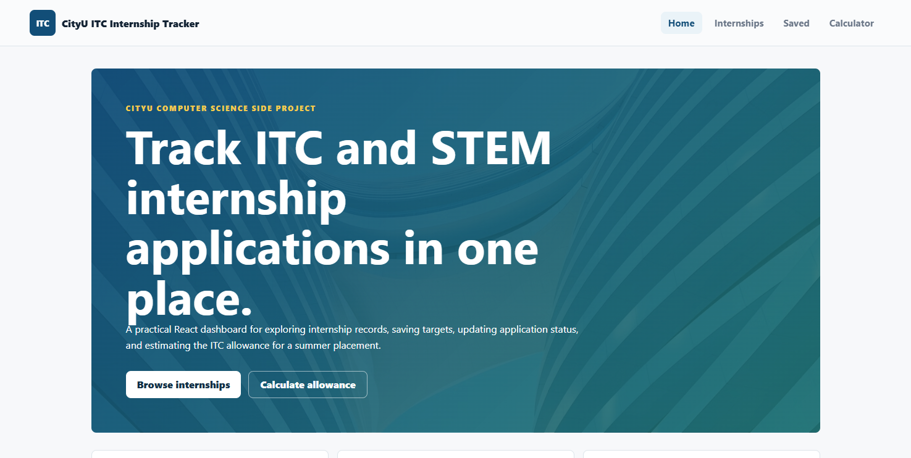
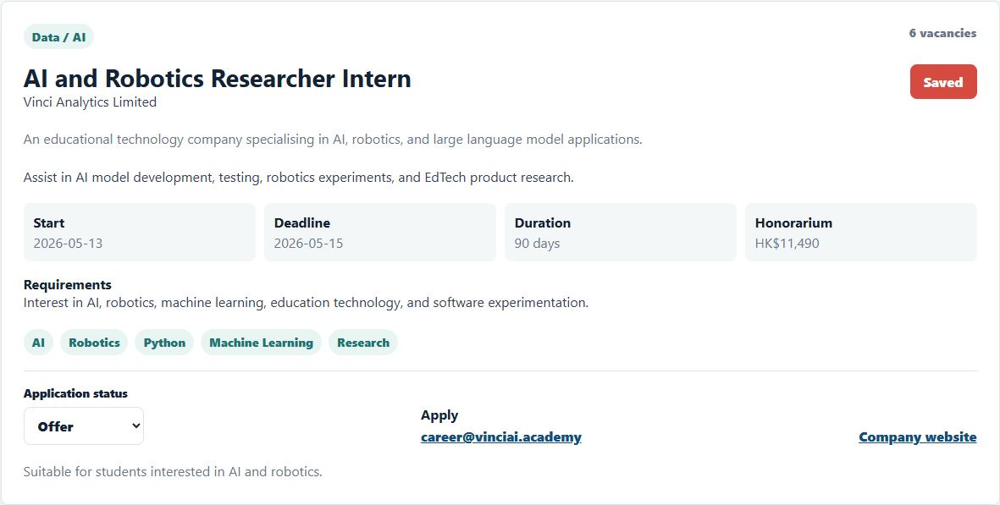
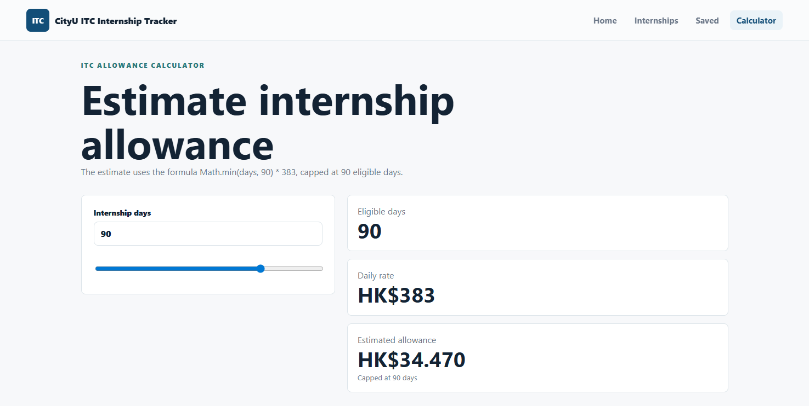

# CityU ITC Internship Tracker

A React + JavaScript front-end side project for a CityU Computer Science student applying for ITC/STEM internships. The app demonstrates practical React, JavaScript, HTML, CSS, bundled JSON data, localStorage, and Git workflow skills without TypeScript, Tailwind, authentication, a real backend, or a database service.

## Features

- Loads internship records from bundled `database.json`
- Displays internship cards with company, role, requirements, skills, deadline, vacancies, honorarium, and application details
- Searches by company, job title, description, requirements, and skills
- Filters by category
- Sorts by deadline soonest, company A-Z, start date earliest, and most vacancies
- Saves internships with localStorage
- Tracks application status with localStorage
- Shows saved internships on a separate page
- Estimates ITC allowance with `Math.min(days, 90) * 383`
- Includes loading, error, and empty states
- Uses responsive CSS for desktop and mobile layouts

## Tech Stack

- React with Vite
- JavaScript
- HTML
- CSS
- React Router
- Fetch API
- Static JSON data
- localStorage
- Git

## Setup

Install dependencies:

```bash
npm install
```

Start the React development server:

```bash
npm run dev
```

Open the local Vite URL shown in the terminal, usually `http://localhost:5173`.

Build the static site:

```bash
npm run build
```

Preview the production build:

```bash
npm run preview
```

## GitHub Pages

Install dependencies, then deploy:

```bash
npm run deploy
```

The deploy script builds the app and publishes the `dist` folder to the `gh-pages` branch.

This repository is configured for:

```text
https://lewinwin.github.io/ITC-CityU-Internship-Dashboard-Management
```

If you rename the GitHub repository later, update these two values:

- `homepage` in `package.json`
- `base` in `vite.config.js`

## Screenshots

### Home Page



### Saved Internship Card



### ITC Allowance Calculator



## Future Improvements

- Add deadline urgency labels
- Add export to CSV for saved internships
- Add notes per internship in localStorage
- Add a simple dashboard chart for application statuses
- Add unit tests for filtering, sorting, and storage utilities
